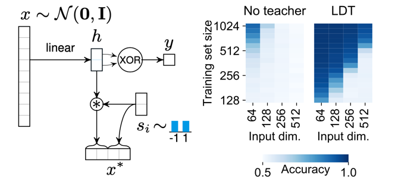
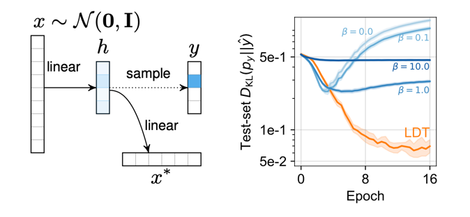

# Learning to distill trajectories (LDT)

Code for: [*A teacher-student framework to distill future trajectories*](https://openreview.net/forum?id=ECuvULjFQia)

Uses the library `higher` (Grefenstette et al. 2019, [GitHub](https://github.com/facebookresearch/higher),  [arXiv](https://arxiv.org/abs/1910.01727)) to compute meta-gradients.

### Dependencies 

- Python : 3.6.12
- [higher](https://github.com/facebookresearch/higher) : 0.2.1
- loguru : 0.5.3
- numpy : 1.19.5
- torch : 1.8.0
- wandb : 0.10.19 (Used by example scripts for tracking metrics)


### Running the example scripts

From the project's root directory run (with activated conda / virtual env):

```python -m ldt.train_synthetic_A --method meta --n-train 512 --inner-lr 1e-3```



```python -m ldt.train_synthetic_B --method meta --batch-size 32 --student-hidden-dim 256```


List of hyperparameters:
```
--method : one of 'meta', 'no-teacher', 'fixed-teacher' (meta refers to meta-gradients)
--seed : Input dimensionality of the task 
--input-dim : Number of training examples 
--n-train : Momentum of inner optimizer
--inner-momentum : Size of all batches
--batch-size : Inner loop learning rate
--inner-lr : Inner loop weight decay
--inner-weight-decay : Teaching coefficient
--teaching-coef : Fraction of data used for validation.
--validation-split : Momentum of the meta-optimizer.
--meta-momentum : Number of inner-loop optimization steps.
--n-inner : Learning rate of meta-optimizer.
--meta-lr : Network width of student.
--student-hidden-dim : Network width of student.
--teacher-hidden-dim : Regularization coef for method "no-teacher"
--entropy-reg-coef : (Only for synthetic-B) entropy regularization coefficient for baselines
```

### Applying to new tasks
This repository uses a generic interface to meta-learn using privileged information.
It requires the following modules and methods:
- **Student** (`nn.Module`). In its forward pass, instead of only returning the target prediction, it is expected to return a tuple `(prediction, internal_activations)`
  The internal activations are going to be supervised by the teacher network.
- **Teacher** (`nn.Module`). Given the privileged data, computes targets for the `internal_activations` exposed by the student.
- `prepare_batch`: Allows arbitrary preparations of each training batch prior to feeding it to the models (such as moving to device)
- `compute_teaching_loss`: Given a teacher, training inputs, privileged data, internal activations of the student, computes the teaching loss used by the student in the inner loop.


## BibTeX:
```
@inproceedings{
neitz2021a,
title={A teacher-student framework to distill future trajectories},
author={Alexander Neitz and Giambattista Parascandolo and Bernhard Sch{\"o}lkopf},
booktitle={International Conference on Learning Representations},
year={2021},
url={https://openreview.net/forum?id=ECuvULjFQia}
}
```
